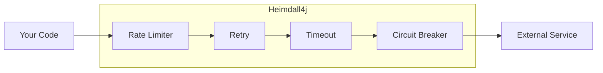
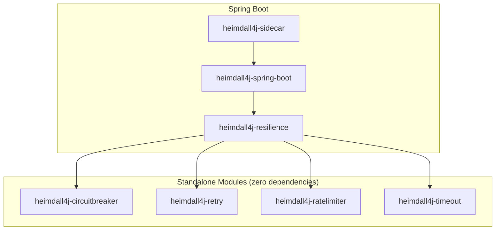

# Heimdall4j

[](https://github.com/haisher/heimdall4j/actions/workflows/ci.yml)
[](https://central.sonatype.com/artifact/io.github.haisher/heimdall4j-circuitbreaker)
[](https://codecov.io/gh/haisher/heimdall4j)
[](https://opensource.org/licenses/MIT)

A modern Java 25 resilience toolkit — composable, lightweight, and Spring Boot–ready.

Protect your service calls with circuit breakers, retries, rate limiters, and timeouts that you can use standalone or compose together into a single policy.



## Why Heimdall4j?

- **Zero dependencies** — each resilience module is standalone pure Java with no transitive baggage
- **Composable** — combine strategies à la carte; use one or all together
- **Modern Java 25** — records, sealed interfaces, virtual threads, `Flow.Publisher`
- **Spring Boot 4 native** — auto-configuration, YAML properties, AOP annotations
- **Observable** — Micrometer metrics, health checks, and structured logging out of the box
- **Lock-free** — AtomicReference CAS patterns for thread safety without blocking

## Quick Start

```groovy
// Pick what you need
dependencies {
    implementation 'io.github.haisher:heimdall4j-circuitbreaker:0.2.2'
    implementation 'io.github.haisher:heimdall4j-retry:0.2.2'
    implementation 'io.github.haisher:heimdall4j-ratelimiter:0.2.2'
    implementation 'io.github.haisher:heimdall4j-timeout:0.2.2'

    // Or use the composable policy (pulls all of the above)
    implementation 'io.github.haisher:heimdall4j-resilience:0.2.2'

    // Spring Boot integration
    implementation 'io.github.haisher:heimdall4j-spring-boot:0.2.2'

    // Observability (metrics, health, logging)
    implementation 'io.github.haisher:heimdall4j-sidecar:0.2.2'
}
```

```xml
<!-- Maven -->
<dependency>
    <groupId>io.github.haisher</groupId>
    <artifactId>heimdall4j-resilience</artifactId>
    <version>0.2.2</version>
</dependency>
```

## Usage

### Standalone (no framework)

```java
// Individual strategy
var cb = CircuitBreaker.of("payments", CircuitBreakerConfig.builder()
    .failureRateThreshold(50)
    .callTimeout(Duration.ofSeconds(2))
    .build());

var result = cb.execute(() -> paymentClient.charge(order));
```

```java
// Composable policy — chain multiple strategies together
var policy = HeimdallPolicy.of("payments")
    .withRateLimiter(RateLimiterConfig.of(100, Duration.ofSeconds(1)))
    .withRetry(RetryConfig.exponentialBackoff(3, Duration.ofMillis(200), 2.0))
    .withTimeout(TimeoutConfig.ofDuration(Duration.ofSeconds(2)))
    .withCircuitBreaker(CircuitBreakerConfig.builder().build())
    .build();

var result = policy.execute(
    () -> paymentClient.charge(order),
    () -> PaymentResult.declined("service unavailable")  // fallback
);
```

### Spring Boot

```yaml
heimdall4j:
  instances:
    payments:
      circuit-breaker:
        failure-rate-threshold: 50
        ring-buffer-size: 100
        wait-duration: 30s
      retry:
        max-attempts: 3
        delay: 200ms
        multiplier: 2.0
      rate-limiter:
        limit-for-period: 100
        refresh-period: 1s
      timeout:
        duration: 2s
```

```java
@Resilient("payments")
public PaymentResult processPayment(Order order) {
    return gateway.charge(order);
}

public Supplier<PaymentResult> processPaymentFallback() {
    return () -> PaymentResult.declined("service unavailable");
}
```

## Modules

| Module | Description | Docs |
|--------|-------------|------|
| [`heimdall4j-circuitbreaker`](heimdall4j-circuitbreaker/) | Circuit breaker — ring buffer, state machine, integrated timeout | [README](heimdall4j-circuitbreaker/README.md) |
| [`heimdall4j-retry`](heimdall4j-retry/) | Retry — fixed delay or exponential backoff | [README](heimdall4j-retry/README.md) |
| [`heimdall4j-ratelimiter`](heimdall4j-ratelimiter/) | Rate limiter — fixed-window algorithm | [README](heimdall4j-ratelimiter/README.md) |
| [`heimdall4j-timeout`](heimdall4j-timeout/) | Timeout — virtual thread execution with cancellation | [README](heimdall4j-timeout/README.md) |
| [`heimdall4j-resilience`](heimdall4j-resilience/) | Composable policy — chains all strategies together | [README](heimdall4j-resilience/README.md) |
| [`heimdall4j-spring-boot`](heimdall4j-spring-boot/) | Spring Boot auto-configuration, `@Heimdall` and `@Resilient` | [README](heimdall4j-spring-boot/README.md) |
| [`heimdall4j-sidecar`](heimdall4j-sidecar/) | Micrometer metrics, health checks, actuator endpoint, logging | [README](heimdall4j-sidecar/README.md) |

## Architecture



Each standalone module works independently with no dependencies. The `resilience` module composes them into a unified policy. The Spring modules add auto-configuration and observability on top.

## Design Principles

| Principle | Implementation |
|-----------|---------------|
| Lock-free concurrency | AtomicReference CAS loops — no synchronized blocks |
| Event-driven | `java.util.concurrent.Flow.Publisher` for all events |
| Functional fallbacks | `Supplier<T>` — compose however you want |
| Testable | `Clock` injection on every executor |
| Immutable config | Java `record` for all configuration |
| Type-safe events | `sealed interface` per module |

## Requirements

- **Java 25+**
- Spring Boot 4.0+ (for spring-boot and sidecar modules)
- Micrometer 1.14+ (for sidecar metrics)

## Building

```bash
./gradlew clean build
```

## License

[MIT](LICENSE)
