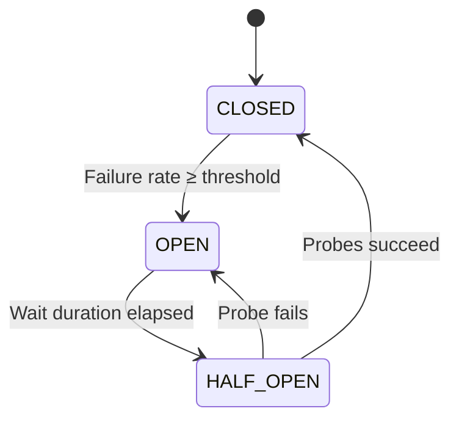
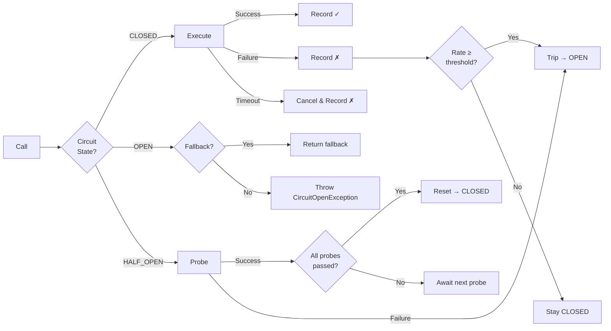

# Heimdall4j

[](https://github.com/haisher/heimdall4j/actions/workflows/ci.yml)
[](https://central.sonatype.com/artifact/io.github.haisher/heimdall4j-circuitbreaker)
[](https://codecov.io/gh/haisher/heimdall4j)
[](https://opensource.org/licenses/MIT)

Modern Java 25 circuit breaker library — slim, zero-dependency core with Spring Boot integration.

## How It Works

A circuit breaker monitors calls to external services and prevents cascading failures. It transitions between three states based on observed failure rates:



When a call is made, the breaker evaluates its current state to decide whether to execute, reject, or probe. Failures are tracked in a ring buffer, and timeouts are enforced with automatic cancellation:



## Installation

### Gradle

```groovy
dependencies {
    implementation 'io.github.haisher:heimdall4j-circuitbreaker:0.1.1'

    // Optional: Spring Boot integration
    implementation 'io.github.haisher:heimdall4j-spring-boot:0.1.1'

    // Optional: Metrics, health checks, and logging
    implementation 'io.github.haisher:heimdall4j-sidecar:0.1.1'
}
```

### Maven

```xml
<dependency>
    <groupId>io.github.haisher</groupId>
    <artifactId>heimdall4j-circuitbreaker</artifactId>
    <version>0.1.1</version>
</dependency>
```

## Usage

### Core (standalone, zero dependencies)

```java
import io.github.haisher.heimdall4j.circuitbreaker.CircuitBreaker;
import io.github.haisher.heimdall4j.circuitbreaker.CircuitBreakerConfig;

var config = CircuitBreakerConfig.builder()
    .failureRateThreshold(50)
    .ringBufferSize(100)
    .waitDurationInOpenState(Duration.ofSeconds(30))
    .permittedCallsInHalfOpen(10)
    .callTimeout(Duration.ofSeconds(2))
    .build();

var cb = CircuitBreaker.of("payments", config);

// With fallback
var result = cb.execute(
    () -> callExternalService(),
    () -> fallbackValue()
);

// Without fallback (throws CircuitOpenException when open)
var result = cb.execute(() -> callExternalService());
```

### Event Subscription

```java
cb.eventPublisher().subscribe(new Flow.Subscriber<>() {
    // React to state transitions, call successes, failures, and timeouts
});
```

### Spring Boot

#### Configuration via properties

```yaml
heimdall4j:
  instances:
    payments:
      failure-rate-threshold: 50
      ring-buffer-size: 100
      wait-duration: 30s
      call-timeout: 2s
    inventory:
      failure-rate-threshold: 70
      ring-buffer-size: 50
```

#### Annotation-based usage

```java
@Heimdall("payments")
public PaymentResult processPayment(Order order) {
    return gateway.charge(order);
}

// Convention-based fallback: <methodName>Fallback() returning Supplier<T>
public Supplier<PaymentResult> processPaymentFallback() {
    return () -> PaymentResult.declined("service unavailable");
}
```

#### Programmatic usage with registry

```java
@Autowired
private HeimdallRegistry registry;

public void doWork() {
    CircuitBreaker cb = registry.get("payments").orElseThrow();
    return cb.execute(() -> externalCall());
}
```

### Observability (Sidecar)

Add `heimdall4j-sidecar` for automatic:

- **Micrometer metrics** — counters for successes/failures/timeouts, state gauge, call duration timer
- **Health indicator** — reports DOWN when any breaker is OPEN
- **Actuator endpoint** — `GET /actuator/circuitbreakers` exposes all breaker states
- **Structured logging** — SLF4J events for state transitions and failures

## Modules

| Module | Description |
|--------|-------------|
| `heimdall4j-circuitbreaker` | Standalone circuit breaker — zero dependencies, pure Java 25 |
| `heimdall4j-spring-boot` | Spring Boot auto-configuration, `@Heimdall` annotation |
| `heimdall4j-sidecar` | Actuator endpoint, Micrometer metrics, structured logging |

## Design Decisions

- **Ring buffer** for failure rate calculation (fixed-size, lock-free via AtomicReference + CAS)
- **Integrated call timeout** — configurable per breaker, cancels slow calls
- **Flow.Publisher** for event emission (Java 9+ reactive streams)
- **Functional fallback** via `Supplier<T>`
- **Probe count** strategy for half-open → closed transitions

## Requirements

- Java 25+
- Spring Boot 4.0+ (for spring-boot and sidecar modules)
- Micrometer 1.14+ (for sidecar metrics)

## Building

```bash
./gradlew clean build
```

## License

[MIT](LICENSE)
