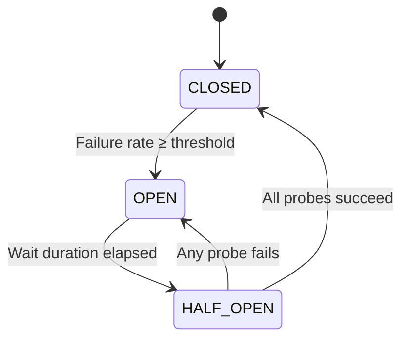
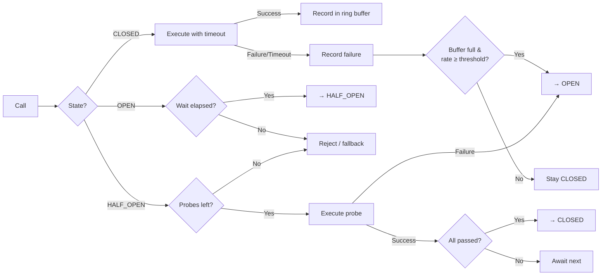

# heimdall4j-circuitbreaker

Standalone circuit breaker — zero dependencies, pure Java 25.



## What It Does

Monitors calls to external services and prevents cascading failures by opening the circuit when the failure rate exceeds a threshold. Failures are tracked in a fixed-size ring buffer using lock-free CAS operations. Each call is executed with a configurable timeout on a virtual thread, and slow calls are automatically cancelled.

## Installation

```groovy
dependencies {
    implementation 'io.github.haisher:heimdall4j-circuitbreaker:0.2.2'
}
```

```xml
<dependency>
    <groupId>io.github.haisher</groupId>
    <artifactId>heimdall4j-circuitbreaker</artifactId>
    <version>0.2.2</version>
</dependency>
```

## Usage

### Basic

```java
import io.github.haisher.heimdall4j.circuitbreaker.*;

var config = CircuitBreakerConfig.builder()
    .failureRateThreshold(50)       // trip at 50% failures
    .ringBufferSize(100)            // evaluate over last 100 calls
    .waitDurationInOpenState(Duration.ofSeconds(30))
    .permittedCallsInHalfOpen(10)   // 10 probe calls before closing
    .callTimeout(Duration.ofSeconds(2))
    .build();

var cb = CircuitBreaker.of("payments", config);

// Throws CircuitOpenException when circuit is open
var result = cb.execute(() -> paymentClient.charge(order));
```

### With Fallback

```java
// Fallback is invoked when the circuit refuses the call (OPEN or probe limit reached)
var result = cb.execute(
    () -> paymentClient.charge(order),
    () -> PaymentResult.declined("service unavailable")
);
```

### Custom Failure Recording

```java
var config = CircuitBreakerConfig.builder()
    .recordFailure(ex -> ex instanceof IOException)  // only IO errors count
    .build();
```

### Event Subscription

```java
cb.eventPublisher().subscribe(new Flow.Subscriber<CircuitBreakerEvent>() {
    @Override public void onSubscribe(Flow.Subscription subscription) {
        subscription.request(Long.MAX_VALUE);
    }

    @Override public void onNext(CircuitBreakerEvent event) {
        switch (event) {
            case CircuitBreakerEvent.StateTransition t ->
                log.info("{}: {} → {}", t.name(), t.from(), t.to());
            case CircuitBreakerEvent.CallFailure f ->
                log.warn("{}: failed in {}", f.name(), f.duration());
            case CircuitBreakerEvent.CallSuccess s ->
                log.debug("{}: success in {}", s.name(), s.duration());
            case CircuitBreakerEvent.CallTimeout t ->
                log.warn("{}: timed out after {}", t.name(), t.timeout());
        }
    }

    @Override public void onError(Throwable throwable) {}
    @Override public void onComplete() {}
});
```

## Configuration Reference

| Parameter | Default | Description |
|-----------|---------|-------------|
| `failureRateThreshold` | 50 | Percentage (1–100) at which the circuit trips |
| `ringBufferSize` | 100 | Number of calls tracked for failure rate calculation |
| `waitDurationInOpenState` | 30s | How long the circuit stays open before probing |
| `permittedCallsInHalfOpen` | 10 | Number of probe calls allowed in half-open |
| `callTimeout` | 5s | Max duration per call (enforced via virtual thread) |
| `recordFailure` | all exceptions | Predicate to filter which exceptions count as failures |
| `clock` | system UTC | Clock for time-based operations (testability) |

## How It Works



## Thread Safety

All state transitions use `AtomicReference` compare-and-set loops — no locks. Multiple threads can call `execute()` concurrently. The ring buffer is immutable (each write creates a new instance), and state transitions are atomic.

## Exceptions

| Exception | When |
|-----------|------|
| `CircuitOpenException` | Circuit is open and no fallback provided |
| `CallTimeoutException` | Call exceeded the configured timeout |
