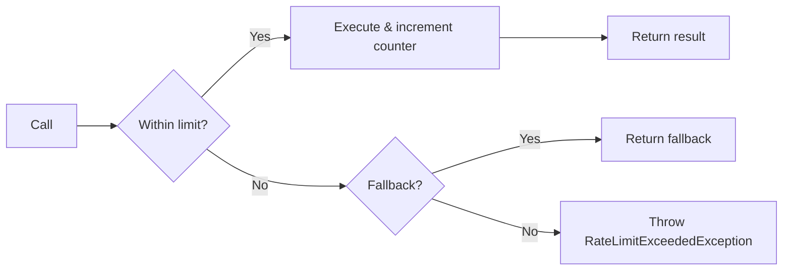
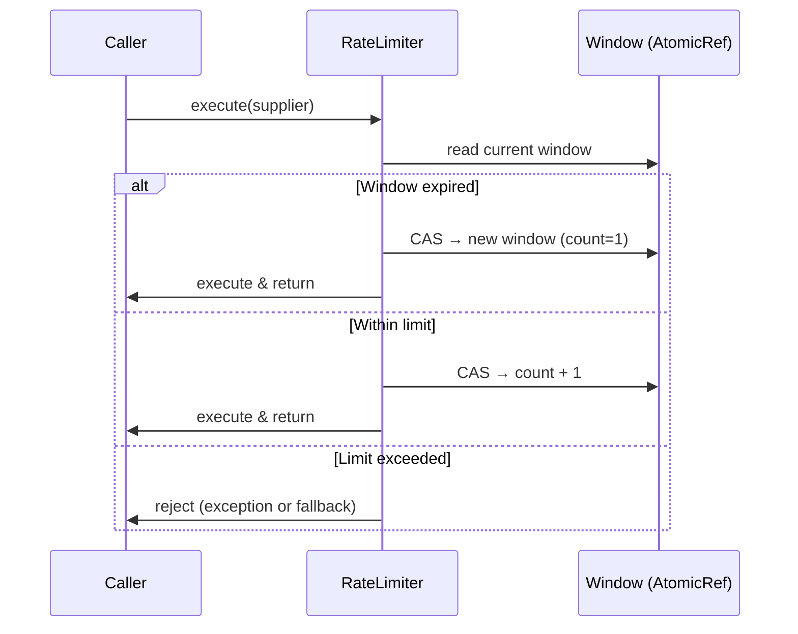

# heimdall4j-ratelimiter

Standalone rate limiter — fixed-window algorithm, zero dependencies.



## What It Does

Restricts the number of calls allowed within a fixed time window. When the limit is exceeded, calls are immediately rejected. Uses a lock-free `AtomicReference` CAS loop for thread safety — no blocking under contention.

## Installation

```groovy
dependencies {
    implementation 'io.github.haisher:heimdall4j-ratelimiter:0.2.2'
}
```

```xml
<dependency>
    <groupId>io.github.haisher</groupId>
    <artifactId>heimdall4j-ratelimiter</artifactId>
    <version>0.2.2</version>
</dependency>
```

## Usage

### Basic

```java
import io.github.haisher.heimdall4j.ratelimiter.*;

// Allow 100 calls per second
var config = RateLimiterConfig.of(100, Duration.ofSeconds(1));
var limiter = RateLimiterExecutor.of("api-gateway", config);

var result = limiter.execute(() -> apiClient.fetch(request));
```

### With Fallback

```java
var result = limiter.execute(
    () -> apiClient.fetch(request),
    () -> cachedResponse()  // serve from cache when rate-limited
);
```

### Builder API

```java
var config = RateLimiterConfig.builder()
    .limitForPeriod(50)
    .refreshPeriod(Duration.ofMinutes(1))
    .build();
```

### Event Subscription

```java
limiter.eventPublisher().subscribe(new Flow.Subscriber<RateLimiterEvent>() {
    @Override public void onNext(RateLimiterEvent event) {
        switch (event) {
            case RateLimiterEvent.Permitted p ->
                log.debug("{}: call permitted", p.name());
            case RateLimiterEvent.Rejected r ->
                log.warn("{}: rate limit exceeded", r.name());
        }
    }
    // ... other subscriber methods
});
```

## Configuration Reference

| Parameter | Default | Description |
|-----------|---------|-------------|
| `limitForPeriod` | 50 | Maximum calls allowed per refresh period |
| `refreshPeriod` | 1s | Duration of each time window |

## How It Works



The rate limiter uses a **fixed-window algorithm**:
1. Each window has a start timestamp and a call counter
2. When a call arrives, check if the current window has expired → reset if yes
3. If counter < limit → increment and execute
4. If counter ≥ limit → reject

Window transitions are atomic via `AtomicReference.compareAndSet` — no locks needed.

## Exceptions

| Exception | When |
|-----------|------|
| `RateLimitExceededException` | Call limit reached for the current window and no fallback provided |
