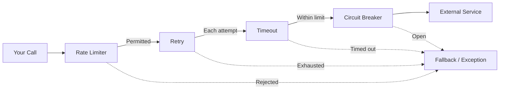
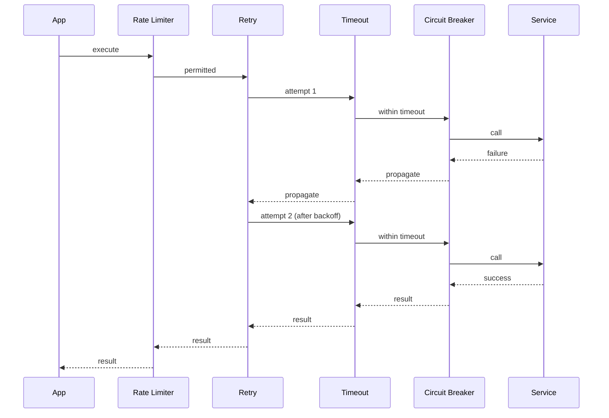

# heimdall4j-resilience

Composable resilience policy — chains circuit breaker, retry, rate limiter, and timeout into a single execution.



## What It Does

Composes all standalone Heimdall4j strategies into a single, ordered pipeline. You pick which layers you need — the builder constructs the decorator chain automatically. Execution order is always:

**Rate Limiter → Retry → Timeout → Circuit Breaker → Your Call**

This ensures:
- Rate limiter gates entry (no wasted retries on rate-limited calls)
- Each retry attempt gets its own timeout
- Circuit breaker records per-attempt outcomes accurately

## Installation

```groovy
dependencies {
    implementation 'io.github.haisher:heimdall4j-resilience:0.2.2'
}
```

This transitively pulls `heimdall4j-circuitbreaker`, `heimdall4j-retry`, `heimdall4j-ratelimiter`, and `heimdall4j-timeout`.

```xml
<dependency>
    <groupId>io.github.haisher</groupId>
    <artifactId>heimdall4j-resilience</artifactId>
    <version>0.2.2</version>
</dependency>
```

## Usage

### Full Policy

```java
import io.github.haisher.heimdall4j.resilience.HeimdallPolicy;
import io.github.haisher.heimdall4j.circuitbreaker.CircuitBreakerConfig;
import io.github.haisher.heimdall4j.retry.RetryConfig;
import io.github.haisher.heimdall4j.ratelimiter.RateLimiterConfig;
import io.github.haisher.heimdall4j.timeout.TimeoutConfig;

var policy = HeimdallPolicy.of("payments")
    .withRateLimiter(RateLimiterConfig.of(100, Duration.ofSeconds(1)))
    .withRetry(RetryConfig.exponentialBackoff(3, Duration.ofMillis(200), 2.0))
    .withTimeout(TimeoutConfig.ofDuration(Duration.ofSeconds(2)))
    .withCircuitBreaker(CircuitBreakerConfig.builder()
        .failureRateThreshold(50)
        .build())
    .build();

var result = policy.execute(() -> paymentClient.charge(order));
```

### With Fallback

```java
var result = policy.execute(
    () -> paymentClient.charge(order),
    () -> PaymentResult.declined("service unavailable")
);
```

### Partial Policies (use only what you need)

```java
// Just retry + timeout (no circuit breaker, no rate limiter)
var policy = HeimdallPolicy.of("email-sender")
    .withRetry(RetryConfig.fixedDelay(5, Duration.ofSeconds(1)))
    .withTimeout(TimeoutConfig.ofDuration(Duration.ofSeconds(10)))
    .build();
```

### Access Individual Layers

```java
// Inspect state of the underlying circuit breaker
if (policy.circuitBreaker() != null) {
    StateName state = policy.circuitBreaker().state();
}
```

### Cleanup

```java
// Closes all event publishers in the policy
policy.close();
```

## Execution Order Explained



## Fallback Semantics

The fallback is delegated to the **innermost** configured layer only, to avoid double-invocation:

| Innermost Layer | Fallback triggers on |
|----------------|---------------------|
| Circuit Breaker | Circuit refuses the call (OPEN/half-open limit) |
| Timeout (no CB) | Call exceeds timeout |
| Retry (no CB, no timeout) | All retries exhausted |
| Rate Limiter (alone) | Rate limit exceeded |

> **Note:** The fallback does NOT catch arbitrary supplier exceptions — it only handles the specific failure mode of the innermost layer.

## API Reference

### Builder Methods

| Method | Description |
|--------|-------------|
| `HeimdallPolicy.of(name)` | Start building a named policy |
| `.withCircuitBreaker(config)` | Add circuit breaker layer |
| `.withRetry(config)` | Add retry layer |
| `.withRateLimiter(config)` | Add rate limiter layer |
| `.withTimeout(config)` | Add timeout layer |
| `.build()` | Build the policy (at least one layer required) |

### Policy Methods

| Method | Description |
|--------|-------------|
| `execute(supplier)` | Execute through all layers |
| `execute(supplier, fallback)` | Execute with fallback |
| `name()` | Policy name |
| `circuitBreaker()` | Underlying CB (nullable) |
| `retryExecutor()` | Underlying retry (nullable) |
| `rateLimiterExecutor()` | Underlying rate limiter (nullable) |
| `timeoutExecutor()` | Underlying timeout (nullable) |
| `close()` | Close all event publishers |
