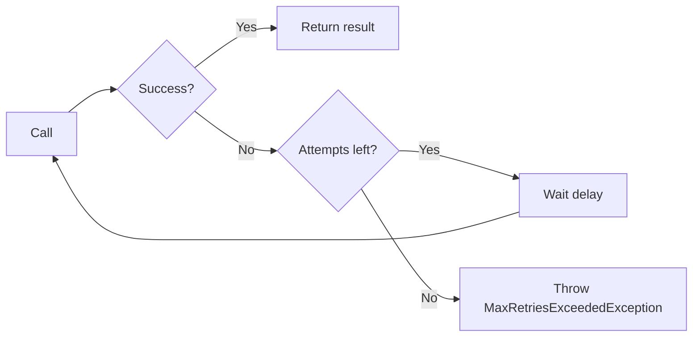

# heimdall4j-retry

Standalone retry executor — fixed delay or exponential backoff, zero dependencies.



## What It Does

Retries a failed call with configurable delay between attempts. Supports fixed-delay and exponential-backoff strategies. Uses `Thread.sleep` for delays (lightweight with virtual threads). Events are emitted via `Flow.Publisher` for observability.

## Installation

```groovy
dependencies {
    implementation 'io.github.haisher:heimdall4j-retry:0.1.2'
}
```

```xml
<dependency>
    <groupId>io.github.haisher</groupId>
    <artifactId>heimdall4j-retry</artifactId>
    <version>0.1.2</version>
</dependency>
```

## Usage

### Fixed Delay

```java
import io.github.haisher.heimdall4j.retry.*;

var config = RetryConfig.fixedDelay(3, Duration.ofMillis(200));
var retry = RetryExecutor.of("payments", config);

var result = retry.execute(() -> paymentClient.charge(order));
```

### Exponential Backoff

```java
// 3 attempts: 100ms → 200ms → 400ms
var config = RetryConfig.exponentialBackoff(3, Duration.ofMillis(100), 2.0);
var retry = RetryExecutor.of("payments", config);

var result = retry.execute(() -> paymentClient.charge(order));
```

### With Fallback

```java
var result = retry.execute(
    () -> paymentClient.charge(order),
    () -> PaymentResult.declined("retries exhausted")
);
```

### Selective Retry

```java
var config = RetryConfig.builder()
    .maxAttempts(3)
    .delay(Duration.ofMillis(500))
    .retryOn(ex -> ex instanceof IOException)  // only retry IO errors
    .build();
```

### Event Subscription

```java
retry.eventPublisher().subscribe(new Flow.Subscriber<RetryEvent>() {
    @Override public void onNext(RetryEvent event) {
        switch (event) {
            case RetryEvent.AttemptFailed f ->
                log.warn("{}: attempt {} failed", f.name(), f.attempt());
            case RetryEvent.RetriesExhausted e ->
                log.error("{}: all {} attempts failed", e.name(), e.maxAttempts());
            case RetryEvent.Success s ->
                log.debug("{}: succeeded on attempt {}", s.name(), s.attempt());
        }
    }
    // ... other subscriber methods
});
```

## Configuration Reference

| Parameter | Default | Description |
|-----------|---------|-------------|
| `maxAttempts` | 3 | Total number of attempts (including first call) |
| `delay` | 500ms | Base delay between attempts |
| `multiplier` | 1.0 | Multiplier for exponential backoff (1.0 = fixed delay) |
| `retryOn` | all exceptions | Predicate to filter which exceptions trigger a retry |

## Backoff Calculation

For attempt `n` (0-indexed): `delay × multiplier^n`

| Attempt | Fixed (200ms) | Exponential (100ms, ×2.0) |
|---------|---------------|---------------------------|
| 1st retry | 200ms | 100ms |
| 2nd retry | 200ms | 200ms |
| 3rd retry | 200ms | 400ms |

## Exceptions

| Exception | When |
|-----------|------|
| `MaxRetriesExceededException` | All attempts exhausted and no fallback provided |
