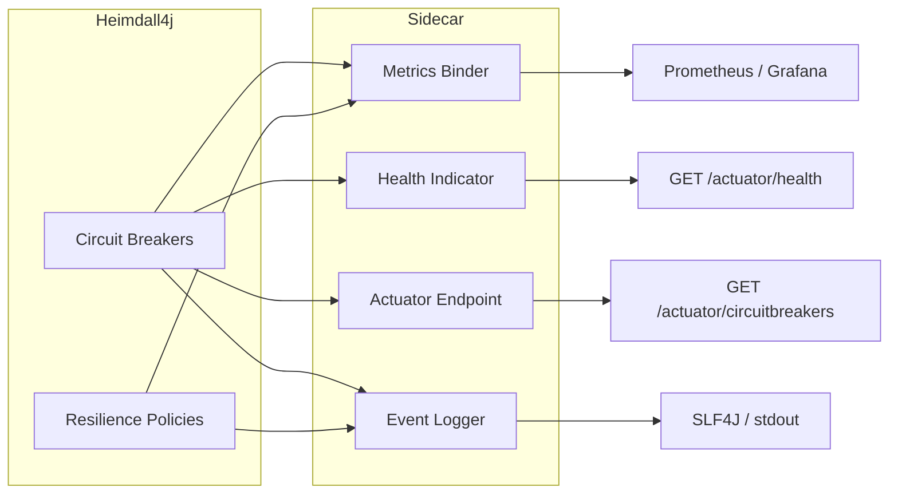

# heimdall4j-sidecar

Observability for Heimdall4j — Micrometer metrics, health checks, actuator endpoint, and structured logging.



## What It Does

Automatically subscribes to all Heimdall4j circuit breakers and resilience policies to expose operational telemetry. Just add the dependency — Spring Boot auto-configuration handles the rest.

## Installation

```groovy
dependencies {
    implementation 'io.github.haisher:heimdall4j-sidecar:0.1.2'
    implementation 'org.springframework.boot:spring-boot-starter-actuator'
}
```

```xml
<dependency>
    <groupId>io.github.haisher</groupId>
    <artifactId>heimdall4j-sidecar</artifactId>
    <version>0.1.2</version>
</dependency>
```

## What You Get

### Micrometer Metrics

#### Circuit Breaker Metrics

| Metric | Type | Description |
|--------|------|-------------|
| `heimdall4j.circuitbreaker.calls` | Counter | Calls by outcome (`success`, `failure`, `timeout`) |
| `heimdall4j.circuitbreaker.state` | Gauge | Current state (0=closed, 1=open, 2=half-open) |
| `heimdall4j.circuitbreaker.call.duration` | Timer | Call execution time |

#### Resilience Metrics

| Metric | Type | Description |
|--------|------|-------------|
| `heimdall4j.retry.attempts` | Counter | Retry attempts |
| `heimdall4j.retry.exhausted` | Counter | All retries failed |
| `heimdall4j.retry.duration` | Timer | Total retry duration |
| `heimdall4j.ratelimiter.permitted` | Counter | Calls permitted |
| `heimdall4j.ratelimiter.rejected` | Counter | Calls rejected |
| `heimdall4j.timeout.success` | Counter | Calls within timeout |
| `heimdall4j.timeout.timed_out` | Counter | Calls that timed out |

All metrics are tagged with `name` (the instance name).

### Health Indicator

Reports `DOWN` when any circuit breaker is in `OPEN` state:

```json
{
  "status": "DOWN",
  "components": {
    "heimdall4j": {
      "status": "DOWN",
      "details": {
        "payments": "OPEN",
        "inventory": "CLOSED"
      }
    }
  }
}
```

### Actuator Endpoint

`GET /actuator/circuitbreakers` exposes all breaker states:

```json
{
  "circuitBreakers": {
    "payments": {
      "name": "payments",
      "state": "CLOSED"
    },
    "inventory": {
      "name": "inventory",
      "state": "HALF_OPEN"
    }
  }
}
```

Enable in `application.yml`:

```yaml
management:
  endpoints:
    web:
      exposure:
        include: health, circuitbreakers
```

### Structured Logging

SLF4J events for state transitions, failures, and rejections:

```
WARN  [heimdall4j] payments: state transition CLOSED → OPEN
WARN  [heimdall4j] payments: call failed (duration=1.234s)
WARN  [heimdall4j] payments: call timed out (timeout=2s)
INFO  [heimdall4j] payments: retry attempt 2 failed
ERROR [heimdall4j] payments: retries exhausted (attempts=3)
WARN  [heimdall4j] api-gateway: rate limit exceeded
```

## Configuration

The sidecar auto-configures itself — no additional properties needed. It activates when:

- `HeimdallRegistry` is present → enables CB metrics, health, endpoint, logging
- `HeimdallPolicyRegistry` is present → enables resilience metrics, resilience logging

Both can be active simultaneously for setups that use legacy CB config and new resilience policies.

## Beans Provided

| Bean | Condition | Description |
|------|-----------|-------------|
| `HeimdallMetricsBinder` | MeterRegistry + HeimdallRegistry | CB metrics |
| `HeimdallResilienceMetricsBinder` | MeterRegistry + HeimdallPolicyRegistry | Retry/RL/Timeout metrics |
| `HeimdallHealthIndicator` | HealthIndicator + HeimdallRegistry | Health check |
| `HeimdallEndpoint` | Endpoint + HeimdallRegistry | Actuator endpoint |
| `HeimdallEventLogger` | HeimdallRegistry | CB event logging |
| `HeimdallResilienceEventLogger` | HeimdallPolicyRegistry | Resilience event logging |
