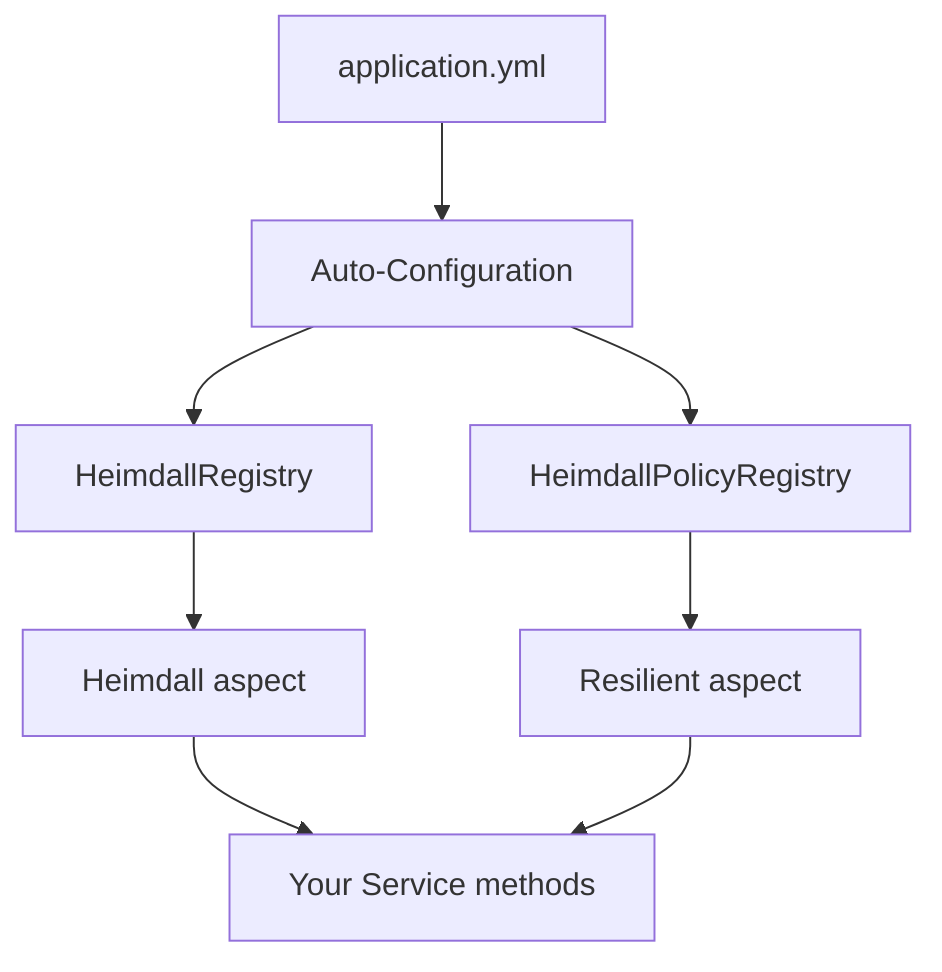

# heimdall4j-spring-boot

Spring Boot 4 auto-configuration for Heimdall4j — YAML-driven setup, AOP annotations, and registries.



## What It Does

Reads `heimdall4j.instances.*` from your Spring Boot configuration and automatically creates circuit breakers and resilience policies. Provides two AOP annotations for declarative usage and registries for programmatic access.

## Installation

```groovy
dependencies {
    implementation 'io.github.haisher:heimdall4j-spring-boot:0.1.2'
}
```

```xml
<dependency>
    <groupId>io.github.haisher</groupId>
    <artifactId>heimdall4j-spring-boot</artifactId>
    <version>0.1.2</version>
</dependency>
```

## Configuration

### Full Resilience Policy (recommended)

```yaml
heimdall4j:
  instances:
    payments:
      circuit-breaker:
        failure-rate-threshold: 50
        ring-buffer-size: 100
        wait-duration: 30s
        permitted-calls-in-half-open: 10
        call-timeout: 5s
      retry:
        max-attempts: 3
        delay: 200ms
        multiplier: 2.0
      rate-limiter:
        limit-for-period: 100
        refresh-period: 1s
      timeout:
        duration: 2s
    inventory:
      circuit-breaker:
        failure-rate-threshold: 70
      timeout:
        duration: 5s
```

### Legacy Circuit-Breaker-Only (backward compatible)

```yaml
heimdall4j:
  instances:
    payments:
      failure-rate-threshold: 50
      ring-buffer-size: 100
      wait-duration: 30s
      call-timeout: 2s
```

> **Note:** Do not mix flat legacy properties with nested sections for the same instance. If any nested section is present, flat properties are ignored.

## Usage

### @Resilient Annotation (full policy)

```java
@Service
public class PaymentService {

    @Resilient("payments")
    public PaymentResult processPayment(Order order) {
        return gateway.charge(order);
    }

    // Convention: <methodName>Fallback() returning Supplier<T>
    public Supplier<PaymentResult> processPaymentFallback() {
        return () -> PaymentResult.declined("service unavailable");
    }
}
```

### @Heimdall Annotation (circuit breaker only)

```java
@Service
public class InventoryService {

    @Heimdall("inventory")
    public Stock checkStock(String sku) {
        return inventoryClient.getStock(sku);
    }

    public Supplier<Stock> checkStockFallback() {
        return () -> Stock.unknown();
    }
}
```

### Programmatic Access

```java
@Service
public class PaymentService {

    private final HeimdallPolicyRegistry policyRegistry;
    private final HeimdallRegistry cbRegistry;

    public PaymentService(HeimdallPolicyRegistry policyRegistry, HeimdallRegistry cbRegistry) {
        this.policyRegistry = policyRegistry;
        this.cbRegistry = cbRegistry;
    }

    public PaymentResult charge(Order order) {
        // Full policy
        var policy = policyRegistry.get("payments").orElseThrow();
        return policy.execute(() -> gateway.charge(order));
    }

    public Stock checkStock(String sku) {
        // Circuit breaker only
        var cb = cbRegistry.get("inventory").orElseThrow();
        return cb.execute(() -> inventoryClient.getStock(sku));
    }
}
```

## Configuration Reference

### Circuit Breaker Properties

| Property | Default | Description |
|----------|---------|-------------|
| `failure-rate-threshold` | 50 | Failure percentage to trip the circuit |
| `ring-buffer-size` | 100 | Number of calls to evaluate |
| `wait-duration` | 30s | Time before probing in half-open |
| `permitted-calls-in-half-open` | 10 | Probes allowed before closing |
| `call-timeout` | 5s | Max call duration |

### Retry Properties

| Property | Default | Description |
|----------|---------|-------------|
| `max-attempts` | 3 | Total attempts (including first call) |
| `delay` | 500ms | Base delay between retries |
| `multiplier` | 1.0 | Backoff multiplier (1.0 = fixed delay) |

### Rate Limiter Properties

| Property | Default | Description |
|----------|---------|-------------|
| `limit-for-period` | 50 | Max calls per window |
| `refresh-period` | 1s | Window duration |

### Timeout Properties

| Property | Default | Description |
|----------|---------|-------------|
| `duration` | 5s | Max execution time |

## How It Works

1. `HeimdallAutoConfiguration` reads all `heimdall4j.instances.*` properties on startup
2. Legacy flat configs create `CircuitBreaker` instances in `HeimdallRegistry`
3. Nested configs build `HeimdallPolicy` instances in `HeimdallPolicyRegistry`
4. `HeimdallAspect` intercepts `@Heimdall`-annotated methods → routes through CB
5. `ResilientAspect` intercepts `@Resilient`-annotated methods → routes through policy
6. Fallback is resolved by convention: method named `<methodName>Fallback()` returning `Supplier<T>`

## Beans Provided

| Bean | Condition | Description |
|------|-----------|-------------|
| `HeimdallRegistry` | Always | Registry of circuit breakers |
| `HeimdallPolicyRegistry` | Always | Registry of resilience policies |
| `HeimdallAspect` | AspectJ on classpath | AOP for `@Heimdall` |
| `ResilientAspect` | AspectJ on classpath | AOP for `@Resilient` |
