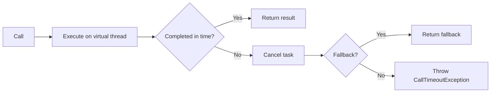

# heimdall4j-timeout

Standalone timeout executor — virtual thread isolation with automatic cancellation.



## What It Does

Wraps a call in a virtual thread and enforces a maximum execution time. If the call doesn't complete within the configured duration, it is cancelled via `Future.cancel(true)` and a timeout event is emitted. Uses Java 25 virtual threads for efficient, lightweight execution without blocking platform threads.

## Installation

```groovy
dependencies {
    implementation 'io.github.haisher:heimdall4j-timeout:0.1.2'
}
```

```xml
<dependency>
    <groupId>io.github.haisher</groupId>
    <artifactId>heimdall4j-timeout</artifactId>
    <version>0.1.2</version>
</dependency>
```

## Usage

### Basic

```java
import io.github.haisher.heimdall4j.timeout.*;

var config = TimeoutConfig.ofDuration(Duration.ofSeconds(2));
var timeout = TimeoutExecutor.of("payments", config);

// Throws CallTimeoutException if the call takes longer than 2 seconds
var result = timeout.execute(() -> paymentClient.charge(order));
```

### With Fallback

```java
var result = timeout.execute(
    () -> paymentClient.charge(order),
    () -> PaymentResult.pending("timed out, will retry later")
);
```

### Builder API

```java
var config = TimeoutConfig.builder()
    .duration(Duration.ofMillis(500))
    .build();
```

### Event Subscription

```java
timeout.eventPublisher().subscribe(new Flow.Subscriber<TimeoutEvent>() {
    @Override public void onNext(TimeoutEvent event) {
        switch (event) {
            case TimeoutEvent.Success s ->
                log.debug("{}: completed in {}", s.name(), s.duration());
            case TimeoutEvent.TimedOut t ->
                log.warn("{}: timed out after {}", t.name(), t.configuredTimeout());
        }
    }
    // ... other subscriber methods
});
```

## Configuration Reference

| Parameter | Default | Description |
|-----------|---------|-------------|
| `duration` | 5s | Maximum allowed execution time per call |

## How It Works

1. The supplier is submitted to a virtual-thread-per-task executor
2. `Future.get(duration, MILLISECONDS)` blocks the calling thread until result or timeout
3. On timeout: `Future.cancel(true)` interrupts the virtual thread
4. Emits `TimeoutEvent.Success` or `TimeoutEvent.TimedOut` via `Flow.Publisher`

Virtual threads are extremely lightweight (a few KB of stack), so one-per-call is efficient even under high concurrency.

## Exceptions

| Exception | When |
|-----------|------|
| `CallTimeoutException` | Call exceeded the configured timeout and no fallback provided |
